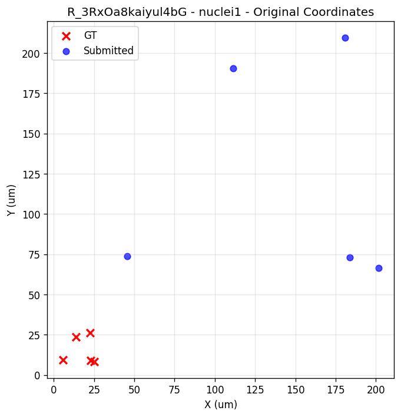
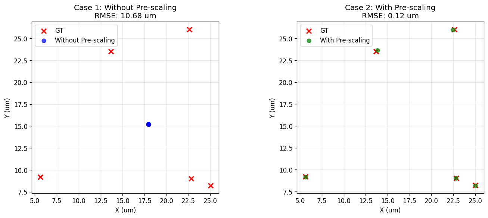

# Summary: Impact of Pre-Scaling on Pixel/Micron Scale Correction

## The Fundamental Issue

This dataset highlights a common error scenario the registration algorithm was designed to handle: **submitted coordinates in pixels while ground truth is in micrometers**. The scale factor between these coordinate systems is substantial (scale ≈ 0.12), making this precisely the type of unit mismatch the algorithm should detect and correct.

However, due to an order-of-operations error in the registration code, the scale correction failed to work properly, resulting in severely misaligned coordinates. This is particularly concerning because pixel-to-micron conversion is a common source of coordinate scaling.

## Dataset Information
- **Response ID**: R_3RxOa8kaiyul4bG
- **Nuclei Dataset**: nuclei1 (out_c00_dr90_label.tif)
- **Software Used**: FIJI/ImageJ
- **User Expertise Level**: 7
- **User Confidence Level**: 7.0
- **Reported LSA MSE (Transformed)**: 114.0890 um²


## What Was Investigated

We examined the point cloud registration algorithm used to align submitted coordinates with ground truth. The registration involves:
1. Calculating a **scale factor** between test and ground truth coordinates
2. Calculating a **translation** to align the centroids
3. Running **rigid registration** (rotation + fine-tuning) using the CPD algorithm

## The Issue: Order of Operations

We discovered a subtle but impactful difference in when the scale is applied:

### Current Implementation (INCORRECT)
```python
# Calculate scale
scale = ground_truth.std() / test_coords.std()

# Calculate translation WITHOUT pre-scaling test coords
translation = ground_truth.mean() - test_coords.mean()  # ❌

# Then run rigid registration with unscaled coords
RigidRegistration(X=gt, Y=test_coords, s=scale, t=translation)
```

### Corrected Implementation
```python
# Calculate scale  
scale = ground_truth.std() / test_coords.std()

# Apply scale FIRST
test_coords_scaled = test_coords * scale

# Calculate translation FROM scaled coords
translation = ground_truth.mean() - test_coords_scaled.mean()  # ✓

# Run rigid registration with scaled coords
RigidRegistration(X=gt, Y=test_coords_scaled, s=scale, t=translation)
```

## Why This Matters

The translation should be calculated in the **same coordinate space** as the registration. When we calculate translation from unscaled coordinates but then apply a scale factor during registration, the translation vector gets implicitly scaled as well, causing misalignment.

Think of it like this: If you measure a distance in meters, but then the registration thinks you're in kilometers, your 100m translation becomes effectively 100km!

## Visual Comparison

### Original Submitted Coordinates vs Ground Truth



The submitted coordinates are in pixel space and need scaling to match the ground truth micron space.

### Registration Results Comparison



**Left**: Without pre-scaling - coordinates remain misaligned with ~10.68 um RMSE error.  
**Right**: With pre-scaling - coordinates align correctly with ~0.12 um RMSE error.

The incorrect approach (blue circles) shows clear systematic offset from ground truth (red x), while the corrected approach (green circles) shows tight alignment.

## Results for This Dataset

| Approach | MSE (um²) | RMSE (um) | 
|----------|-----------|-----------|
| **Paper (Current)** | **114.0890** | **10.68 um** |
| **Without Pre-scaling** | **114.0890** | **10.68 um** |
| **With Pre-scaling** (Corrected) | **0.0145** | **0.12 um** |
| **Improvement** | | **99.99%** |

*Note: Our reproduction without pre-scaling matches the paper's reported value, confirming this is the method used.*

## Context & Next Steps

This is a **small code change** (literally one line: `test_coords *= scale` before computing translation) with **large impact** on results. The error affects all datasets but particularly those with scale factors far from 1.0 — **ironically, the exact scenario the registration was designed to handle**.

The pixel-to-micron conversion error is likely one of the most common mistakes participants could make, yet the registration algorithm fails to correct it properly. This undermines a key objective of the registration approach.

We're sharing this finding constructively because:
- The registration code is complex and this type of subtle bug is understandable
- The impact varies by dataset, so it may not have been obvious in initial testing
- Other datasets had similar errors in their pipelines

